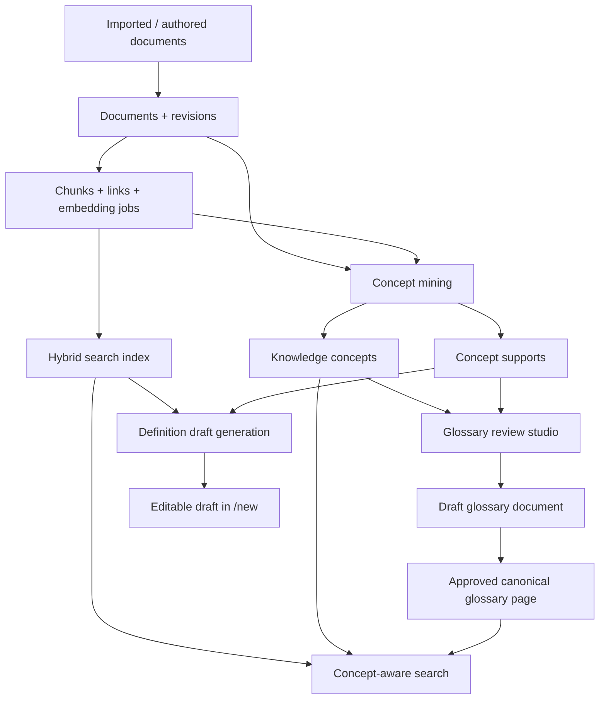

# KnowledgeHub Product Document

## 1. Purpose

This document explains the shipped product as a product system, not just as a codebase.

It is meant to answer four questions clearly:

1. What the product is supposed to do.
2. How users are expected to use it.
3. How the backend, search, glossary, and generation systems cooperate.
4. How to evaluate whether the product is behaving correctly.

If you are new to the repository, read this document before diving into the implementation files.

---

## 2. Product Definition

KnowledgeHub is an internal knowledge product for turning a large, messy document corpus into:

- a searchable operational wiki
- a concept-aware glossary
- an editorial review system for turning repeated terms into durable canonical knowledge
- a grounded draft-generation system that refuses weakly supported answers

The product is intentionally opinionated.

It does not treat the corpus as a flat document bucket.
It treats the corpus as a source of evidence from which the system can derive:

- documents
- revisions
- search chunks
- links
- repeated concepts
- concept support evidence
- canonical glossary pages

The core product promise is:

> For an important internal term, the product should prefer grounded, reviewable, canonical knowledge over quick but weak answers.

---

## 3. Product Philosophy

### 3.1 Quality over speed

This product is explicitly optimized for trustworthiness, editorial control, and grounding quality.

That means:

- exact concept matches are preferred over approximate semantic neighbors
- canonical glossary pages are preferred over on-demand generation
- weak evidence should fail closed instead of producing plausible nonsense
- multiple supporting documents are better than one isolated source
- editors remain in control of what becomes canonical knowledge

### 3.2 Documents are not enough

A large imported corpus contains duplicates, variants, work logs, one-off notes, structured CSV exports, and partially overlapping explanations.

The product therefore needs a concept layer above documents.

Without that layer:

- search is noisy
- generated definitions are brittle
- duplicates dominate retrieval
- glossary pages do not emerge naturally

### 3.3 Canonical knowledge is editorial, not automatic

The product can mine concepts and generate glossary drafts automatically.
It does not auto-publish them.

Canonical glossary content is produced through a human review loop:

1. mine candidate concepts
2. inspect support evidence
3. generate a draft
4. edit if needed
5. approve to publish

---

## 4. Core User Problems

The product is designed to solve several recurring internal knowledge problems.

### 4.1 "I know this term exists, but I do not know where the best definition is."

Example:

- "What does `센디 차량` mean in our domain?"
- "How is `디비딥` used internally?"
- "What is the operational meaning of a metric or process term?"

### 4.2 "The same concept appears in many exported or duplicated documents."

Example:

- multiple Notion exports of the same page
- repeated CSV rows or alternate exports
- title variants like `센디 차량`, `센디 차량 (1)`, `센디 차량 (2)`

The product must recognize that these are often evidence for one concept, not separate glossary entries.

### 4.3 "I want a usable first draft, but I do not want hallucinations."

The user should be able to ask for a definition draft and get:

- structured markdown
- explicit references
- editable content
- grounded claims only

### 4.4 "I need a place to curate concepts, not just browse documents."

This is why the product has dedicated glossary surfaces, review flows, concept statuses, and glossary-specific jobs.

---

## 5. Product Capabilities

The current product supports six major capability areas.

### 5.1 Corpus ingestion and indexing

- document ingestion by API payload
- file upload ingestion
- immutable revisions
- token-aware chunking
- link projection
- embedding job queue
- pgvector + PostgreSQL full-text indexing

### 5.2 Document authoring

- new manual documents
- markdown editing
- visual editing
- slug-based document identity
- metadata such as owner team and doc type
- explicit save confirmation when a new slug would update an existing document

### 5.3 Concept-aware search

- concept resolution from user query
- canonical glossary-first ranking for approved concepts
- lexical relevance filtering
- evidence diversification across duplicate document families
- explain output for why the search result set looks the way it does

### 5.4 Definition draft generation

- topic + optional domain prompting
- evidence assembly from exact documents, concept supports, and filtered hybrid search
- strict citation validation
- deterministic repair and fallback behavior
- editable markdown output instead of auto-publishing

### 5.5 Glossary mining and review

- concept mining from the full published corpus
- support evidence storage
- statuses such as `suggested`, `drafted`, `approved`, `ignored`, and `stale`
- draft generation for glossary entries
- approve, ignore, mark stale, merge, and split workflows

### 5.6 Product quality evaluation

- golden search cases
- golden generation cases
- exact concept resolution checks
- glossary-first ranking checks
- weak-grounding rejection checks
- offline evaluation script for regression detection

---

## 6. Product Surfaces

The frontend is organized around product surfaces, not just technical pages.

### 6.1 `/`

Home dashboard.

Purpose:

- recent activity entrypoint
- top-level navigation
- visibility into the system state

### 6.2 `/docs`

Document explorer.

Purpose:

- browse raw documents
- inspect document-oriented knowledge
- access the canonical wiki layer

### 6.3 `/docs/[slug]`

Document detail page.

Purpose:

- read the actual stored document or glossary page
- inspect headings and relations
- follow backlinks and related documents

### 6.4 `/new`

Authoring surface.

Purpose:

- create manual documents
- upload files
- generate a definition draft from current corpus evidence
- review slug conflicts before updating an existing document

### 6.5 `/search`

Concept-aware search surface.

Purpose:

- search across the corpus
- inspect concept resolution
- understand evidence strength
- see canonical glossary hits rank above generic documents when appropriate

### 6.6 `/glossary`

Approved glossary browser.

Purpose:

- browse canonical concepts
- treat glossary as a first-class product surface
- expose curated concepts separately from the raw document list

### 6.7 `/glossary/review`

Glossary review studio.

Purpose:

- inspect mined concepts
- filter candidates
- inspect supports
- generate or regenerate drafts
- approve or ignore concepts
- merge or split concepts

### 6.8 `/jobs`

Job visibility surface.

Purpose:

- inspect background work
- see embedding and glossary-related job state

---

## 7. User Roles and Main Workflows

### 7.1 Knowledge consumer

Typical goals:

- search for a concept
- find the canonical explanation
- inspect supporting documents if needed

Typical flow:

1. enter a query in `/search`
2. if an approved glossary concept exists, read it first
3. open the linked canonical document
4. fall back to supporting documents if more detail is needed

### 7.2 Document author

Typical goals:

- write or update a manual document
- create a grounded definition draft for a missing concept

Typical flow:

1. open `/new`
2. enter title, slug, metadata, and content
3. optionally ask the system to generate a draft definition from current documents
4. edit the markdown
5. save
6. explicitly confirm if the save would update an existing slug

### 7.3 Glossary reviewer or curator

Typical goals:

- inspect mined concept candidates
- decide what deserves canonical treatment
- create or regenerate glossary drafts
- approve the best canonical page

Typical flow:

1. open `/glossary/review`
2. filter by status, concept type, or owner team
3. inspect support evidence
4. generate a draft
5. optionally edit through the normal document editor
6. approve the draft to publish the canonical glossary page

---

## 8. Product Architecture at a Glance

This diagram shows the product boundary clearly:

- documents are the raw substrate
- concepts are a derived layer
- glossary is a curated projection
- search and generation consume both layers

---

## 9. Runtime Components

The runtime is composed of five main services.

### 9.1 `postgres`

Responsibilities:

- system of record for document and concept data
- search index storage
- job queue persistence

### 9.2 `migrate`

Responsibilities:

- install schema
- apply SQL migrations

### 9.3 `api`

Responsibilities:

- document APIs
- search APIs
- glossary APIs
- ingestion and authoring control plane

### 9.4 `worker`

Responsibilities:

- process embedding jobs
- process glossary refresh jobs

### 9.5 `web`

Responsibilities:

- Next.js product UI
- browser-facing route handlers
- server-side rendering of product pages

---

## 10. Core Domain Model

The product has three layers of state:

1. document layer
2. retrieval layer
3. concept/glossary layer

### 10.1 Document layer

#### `documents`

Stable document identity.

Stores:

- slug
- title
- source identity
- owner team
- doc type
- language
- current revision pointer

#### `document_revisions`

Immutable snapshots.

Stores:

- revision number
- content hash
- markdown content
- plain text content

#### `document_links`

Projection of internal wiki links used for:

- outgoing links
- backlinks
- relation views

### 10.2 Retrieval layer

#### `document_chunks`

Chunk-level retrieval units.

Stores:

- chunk content
- section title
- heading path
- token count
- full-text search vector
- semantic embedding vector

#### `embedding_cache`

Deduplicates embeddings by content hash and profile.

#### `embedding_jobs`

Tracks asynchronous embedding work.

### 10.3 Concept and glossary layer

#### `knowledge_concepts`

Derived concept records.

Stores:

- normalized term
- display term
- aliases
- language code
- concept type
- confidence score
- support counts
- status
- generated draft link
- canonical document link
- owner team hint
- source system mix

#### `concept_supports`

Explains why a concept exists.

Stores:

- supporting document
- optional supporting chunk
- evidence kind
- evidence term
- support text
- evidence strength
- family key for deduplication

#### `glossary_jobs`

Tracks refresh and glossary-draft work.

---

## 11. Document Types and Glossary Statuses

### 11.1 Document types

The product uses document metadata to distinguish content shapes.

Examples:

- `knowledge`
- `data`
- `glossary`

The important rule is:

- glossary pages are still normal documents
- glossary is a curated layer built on top of the document system

### 11.2 Concept statuses

#### `suggested`

Mined automatically and not yet reviewed.

#### `drafted`

A glossary draft document exists, but no canonical approval has happened yet.

#### `approved`

The concept has a canonical published glossary page.

#### `ignored`

The reviewer decided this candidate should not participate in active glossary browsing.

#### `stale`

The concept used to exist but no longer has current corpus support.

---

## 12. Ingestion Pipeline

The ingestion path is the foundation of the entire product.

### 12.1 What happens when content is ingested

1. Parse source content.
2. Normalize markdown and plain text.
3. Resolve the target document identity.
4. Create a new immutable revision if content changed.
5. Chunk the content for retrieval.
6. Refresh document links.
7. Enqueue embedding work.
8. If the document is published and not itself a glossary artifact, enqueue an incremental glossary refresh.

### 12.2 Why this matters for product quality

Glossary quality depends on fresh concept mining.
Concept mining depends on the currently published corpus.

That is why published ingests trigger glossary refresh work automatically.

### 12.3 Slug collision behavior

The product explicitly protects the `/new` workflow from accidental silent overwrite.

Behavior:

- first save from `/new` uses `allow_slug_update=false`
- if the slug already exists, the API returns a structured `409 slug_conflict`
- the editor shows inline confirmation
- only an explicit follow-up save updates the existing document

This is important because generated drafts and manual docs both risk colliding with existing slugs.

---

## 13. Concept Mining Pipeline

Concept mining is how the product graduates from document search to knowledge product behavior.

### 13.1 Mining inputs

The mining pass scans the published corpus and extracts evidence from:

- document titles
- slug/title variants
- section titles
- heading paths
- table-like structured values extracted from CSV-style content

### 13.2 Candidate normalization

The mining system aggressively normalizes variants:

- ordinal suffix variants like `(1)` and `(2)`
- export-specific hex suffix patterns
- repeated slug/title forms

The goal is to collapse obvious duplicates before review.

### 13.3 Candidate filtering

The product intentionally filters noise.

Examples of likely noise:

- one-off meeting notes
- work logs
- asset requests
- weak operational fragments with only one poor support source

### 13.4 Evidence kinds

The current product distinguishes support evidence such as:

- `title`
- `heading`
- `table-field`
- `alias`
- `semantic`
- `canonical`

The evidence kind matters because title and canonical evidence are much stronger than semantic proximity.

### 13.5 Confidence

Confidence is not just semantic similarity.
It is influenced by:

- support document count
- support chunk count
- title evidence
- heading evidence
- table-field evidence
- source-system spread

This makes concept ranking more useful for review than a single vector score would be.

---

## 14. Search and Evidence Assembly

The product no longer treats hybrid search results as the final answer set.

Instead, search uses multi-stage evidence assembly.

### 14.1 Search stages

1. Normalize the query.
2. Resolve a candidate concept from the query.
3. Fetch canonical glossary hit if the concept is approved.
4. Fetch concept-linked support hits.
5. Run hybrid search across chunks.
6. Remove lexically irrelevant semantic neighbors.
7. Diversify results across concept families and documents.
8. Return ranked hits plus an explain payload.

### 14.2 Ranking priorities

Priority order is effectively:

1. canonical glossary page
2. exact or alias concept evidence
3. other concept-linked evidence
4. lexically relevant raw hybrid hits

### 14.3 Why lexical gating exists

Semantic retrieval alone is not safe enough for internal definitions.

Without lexical gating:

- a semantically nearby but unrelated document can appear grounded
- weak single-neighbor evidence can pollute drafts
- cross-domain drift becomes common

The lexical gate is therefore a product safety rule, not just a ranking tweak.

### 14.4 Why diversity exists

Without diversification:

- duplicate exports dominate the top hits
- one concept family can crowd out alternative evidence
- reference lists look larger than they really are

The product therefore caps duplicate families and repeated documents.

### 14.5 Explainability

Search has an explain surface so reviewers can inspect:

- normalized query
- resolved concept
- concept status
- canonical document slug
- weak-grounding signal
- assembled hits

This is part of the product itself, not a debug afterthought.

---

## 15. Definition Draft Generation

Definition draft generation is deliberately conservative.

It is designed to create editable drafts, not final truth.

### 15.1 When generation is used

Generation is appropriate when:

- a user wants a first draft for a concept
- the product does not yet have a good canonical glossary page
- editors want to bootstrap a glossary entry from existing evidence

### 15.2 Generation pipeline

1. Build a normalized topic query.
2. Resolve a concept if possible.
3. Gather exact document hits.
4. Gather concept support hits.
5. Gather lexically relevant hybrid hits.
6. Diversify references.
7. Reject weakly grounded evidence bundles.
8. Generate a structured markdown body.
9. Validate all citations.
10. Repair missing citations if deterministic repair is possible.
11. Retry once with validation feedback if needed.
12. Fall back deterministically only when grounding is strong enough.

### 15.3 Required output structure

The product expects the body to contain, in order:

- `## Definition`
- `## How This Term Is Used Here`
- `## Supporting Details`
- optional middle sections such as `Observed Variants` or `Notes`
- `## Open Questions`

### 15.4 Citation rules

The generator is not allowed to return arbitrary prose.

Rules:

- citations must be `[n]`
- every cited number must exist
- each paragraph or list item in required sections must have at least one citation
- `Open Questions` may be uncited
- the body must contain at least one valid citation overall

### 15.5 Contradiction handling

If the corpus contains multiple valid perspectives, the product should surface that through:

- `Observed Variants`
- `Notes`

It should not pretend the corpus is perfectly consistent when it is not.

### 15.6 Fallback behavior

Fallback is not unconditional.

The product only allows deterministic fallback when the evidence bundle is already strong.

That means:

- strong multi-document evidence can still produce a safe draft if the model fails structurally
- weak single-document evidence should fail closed with not-found behavior

---

## 16. Glossary Review Studio

The glossary review studio is where the product becomes editorial software instead of only search software.

### 16.1 Reviewer actions

The review UI supports:

- full refresh
- incremental refresh
- candidate filtering
- support inspection
- draft generation
- approval
- ignore
- mark stale
- merge
- split

### 16.2 Draft lifecycle

There are two important glossary document states:

1. working draft glossary document
2. canonical published glossary document

The product preserves this distinction even after a concept has already been approved.

That allows:

- future regeneration without overwriting the canonical page immediately
- review before replacing canonical content

### 16.3 Approval behavior

On approval:

- the chosen glossary document becomes the canonical published page
- the stable canonical slug becomes `glossary-{concept-slug}`
- older glossary canonical pages are archived if replaced
- the concept moves to `approved`

This keeps the concept-to-canonical mapping stable.

---

## 17. Why Canonical Glossary Pages Matter

The product does not want every user query to trigger fresh generation forever.

That would be:

- more expensive
- less stable
- less reviewable
- harder to trust

Approved glossary pages solve that.

For exact concept queries, the product should usually behave like this:

1. resolve the concept
2. return the canonical glossary page first
3. still expose supporting documents behind it

That gives users both:

- a stable answer
- traceable evidence

---

## 18. API Surface

The important APIs are grouped by product capability.

### 18.1 Document APIs

- `GET /v1/documents`
- `GET /v1/documents/slug/{slug}`
- `POST /v1/documents/ingest`
- `POST /v1/documents/upload`
- `POST /v1/documents/generate-definition`

### 18.2 Search APIs

- `POST /v1/search`
- `POST /v1/search/explain`

### 18.3 Glossary APIs

- `POST /v1/glossary/refresh`
- `GET /v1/glossary`
- `GET /v1/glossary/{concept_id}`
- `GET /v1/glossary/slug/{slug}`
- `POST /v1/glossary/{concept_id}/draft`
- `PATCH /v1/glossary/{concept_id}`

### 18.4 Job APIs

- admin and job-summary endpoints expose background work state for embedding and glossary work

---

## 19. Product Quality Rules

The product has several quality rules that should be treated as product requirements.

### 19.1 Grounding rule

If the system cannot assemble sufficiently strong multi-document evidence, it should reject the request rather than fabricate a draft.

### 19.2 Canonical-first rule

If a concept is approved and has a canonical glossary page, that page should rank first for exact concept queries.

### 19.3 Duplicate-collapse rule

Duplicate export families should help support a concept without dominating the visible result set.

### 19.4 Editorial control rule

Automatic mining and draft generation are allowed.
Automatic publishing is not.

### 19.5 Explainability rule

Search and glossary review should expose enough evidence to understand why a concept or result exists.

---

## 20. Evaluation Strategy

Evaluation is part of the product design, not only a developer convenience.

### 20.1 What is evaluated

The current evaluation harness checks:

- concept resolution quality
- glossary-first ranking behavior
- result family diversity
- grounded definition generation
- weak-grounding refusal

### 20.2 Why this matters

Without golden checks, a system like this can regress silently.

Examples of silent regressions:

- exact concepts stop ranking first
- weak single-document drafts start passing
- duplicate exports flood references
- canonical glossary pages stop being preferred

### 20.3 Evaluation sources

The current evaluation set is built from representative Sendy corpus terms such as:

- product terms
- glossary-worthy internal terms
- weak-grounding cases that should fail closed

### 20.4 How to run

The evaluation script can run against the current local stack and can optionally refresh concepts first.

This gives the team a product-level quality gate instead of only a unit-test gate.

---

## 21. Local Runtime and Configuration

### 21.1 What is required to boot

The stack can boot locally through Docker Compose.

Main services:

- Postgres
- migration runner
- API
- worker
- web

### 21.2 Embedding and generation profiles

The product distinguishes between:

- embedding configuration
- generation configuration

This matters because:

- search and retrieval depend on embeddings
- glossary draft generation depends on a chat-capable generation model

### 21.3 Local model assumptions

For local quality testing, the product can be configured against an OpenAI-compatible local provider such as Ollama.

That allows:

- local embedding
- local glossary draft generation
- local evaluation runs

---

## 22. Product Behavior with the Sendy Corpus

The `sample-data/sendy-knowledge` corpus is important because it represents a realistic internal knowledge environment:

- many documents
- mixed data shapes
- repeated exported variants
- product, process, and metric terminology
- both prose and structured CSV-like content

This corpus is large enough to surface real product issues:

- duplicate dominance
- weak semantic neighbors
- title variants
- glossary-worthy internal terms

That is why it is the right benchmark for this product.

---

## 23. Known Tradeoffs

Every product decision here is a tradeoff.

### 23.1 Quality vs latency

The product prefers quality.

Result:

- stronger evidence assembly
- more conservative generation
- slower heavy operations when using local models

### 23.2 Editorial control vs automation

The product does not auto-publish mined or generated glossary content.

Result:

- higher trust
- more human work

### 23.3 Stable canonical pages vs instant regeneration

Approved concepts keep a canonical document and can generate a separate working draft for later refresh.

Result:

- safer editorial workflow
- slightly more state to manage

### 23.4 Simplicity vs product richness

The system now has more tables, more APIs, and more UI surfaces than a plain internal wiki.

That complexity is intentional because the product is no longer just a document store.

---

## 24. Guided Reading Order for the Codebase

If you want to understand the system in implementation order, read these files in this sequence.

### 24.1 Product entrypoints

- `README.md`
- `PRODUCT.md`

### 24.2 Backend product behavior

- `internal_kb_fullstack/backend/app/services/ingest.py`
- `internal_kb_fullstack/backend/app/services/search.py`
- `internal_kb_fullstack/backend/app/services/document_drafts.py`
- `internal_kb_fullstack/backend/app/services/glossary.py`
- `internal_kb_fullstack/backend/app/services/worker.py`

### 24.3 Backend schemas and routes

- `internal_kb_fullstack/backend/app/schemas/documents.py`
- `internal_kb_fullstack/backend/app/schemas/search.py`
- `internal_kb_fullstack/backend/app/schemas/glossary.py`
- `internal_kb_fullstack/backend/app/api/routes/documents.py`
- `internal_kb_fullstack/backend/app/api/routes/search.py`
- `internal_kb_fullstack/backend/app/api/routes/glossary.py`

### 24.4 Database layer

- `internal_kb_fullstack/backend/app/db/models.py`
- `internal_kb_fullstack/backend/app/db/sql/001_init.sql`
- `internal_kb_fullstack/backend/app/db/sql/003_glossary_layer.sql`

### 24.5 Frontend product surfaces

- `internal_kb_fullstack/frontend/app/page.tsx`
- `internal_kb_fullstack/frontend/app/search/page.tsx`
- `internal_kb_fullstack/frontend/app/new/page.tsx`
- `internal_kb_fullstack/frontend/app/glossary/page.tsx`
- `internal_kb_fullstack/frontend/app/glossary/review/page.tsx`
- `internal_kb_fullstack/frontend/app/docs/[slug]/page.tsx`
- `internal_kb_fullstack/frontend/components/editor/document-editor.tsx`
- `internal_kb_fullstack/frontend/components/search/semantic-search-page.tsx`
- `internal_kb_fullstack/frontend/components/glossary/glossary-review-page.tsx`

### 24.6 Quality gates

- `internal_kb_fullstack/backend/tests/`
- `internal_kb_fullstack/backend/evals/sendy_glossary_eval.json`
- `internal_kb_fullstack/backend/scripts/evaluate_glossary_quality.py`

---

## 25. What "Good" Looks Like

The product is behaving well when the following are true:

- important internal terms resolve to a concept cleanly
- approved glossary entries rank above raw documents for exact concept queries
- result sets show multiple evidence families instead of duplicate floods
- weakly supported definition requests fail closed
- strong concepts can generate editable drafts with valid citations
- reviewers can create, inspect, and approve canonical glossary pages safely
- newly published documents feed back into glossary refresh behavior

---

## 26. Future Extension Areas

The current product is already substantially more than a plain wiki, but there are obvious extension areas.

Examples:

- richer contradiction summarization
- concept family visualizations
- reviewer assignment and ownership queues
- glossary freshness monitoring
- better structured extraction from CSV-heavy documents
- stronger offline evaluation coverage
- richer document family clustering

These are extensions to the same product direction, not a different strategy.

---

## 27. Final Summary

KnowledgeHub is now best understood as a quality-first internal knowledge system with four connected layers:

1. document storage and revision history
2. retrieval and search indexing
3. concept mining and glossary state
4. editorially reviewed canonical knowledge

Its key product choice is simple:

> Prefer grounded, explainable, reviewable knowledge over fast but weak answers.

That choice drives the entire system:

- how the corpus is indexed
- how concepts are mined
- how search is ranked
- how drafts are generated
- how glossary pages are approved
- how regressions are evaluated

